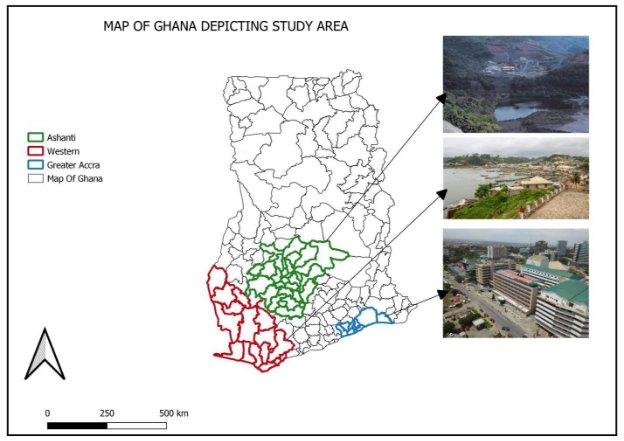
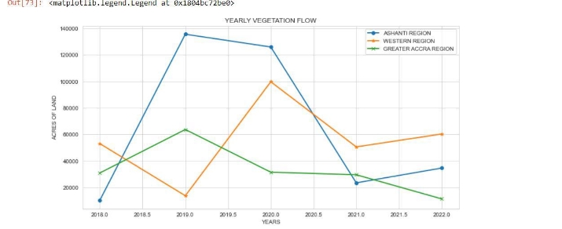
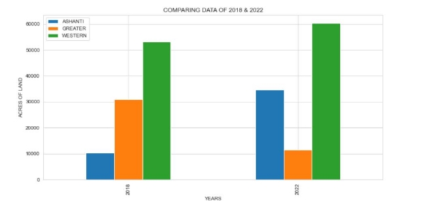



**CLOUD COMPUTING** 

**USING GOOGLE EARTH ENGINE AND SATELLITE IMAGERY TO ASSESS THE IMPACT OF ILLEGAL MINNING ON VEGETATION COVER.** 

**(A CASE STUDY IN GHANA)** ISAAC KWABIA 

` `LECTURERS: PROF JENS MÜLLER 

MR MOHIUDDIN GULAM 

**1.ABSTRACT** 

Mining has been part of Ghana’s history and significant to the growth of Ghana’s economy. Ghana is a major export of gold in Africa and acquired through mining activities but recent public outcry on the devastating impacts of it on Ghana’s vegetation and water bodies. Its activities have been led to significant impact on loss of certain patches of vegetation since it comes with its own risk and benefit. The activities are destructive in as much as is whether practiced legal or illegal. Illegal mining is mostly considered as environmental destructive due to its way of execution. This study assesses the impact of illegal mining on vegetation cover, a case study in Ghana. The study employs the usage of the cloud services of Google earth engine and the code editor to compute the statistics of vegetation cover within a period. Different areas are selected based on legally practiced mining activity, illegally practiced mining activity and without mining activity. Normalized Difference Vegetation Index (NDVI) analysis is done to assess also the changes across the selected areas. It resulted as Ashanti region with increased record of illegal mining had the higher decrease in vegetation cover under the period of study. Comparing it to the western region with legal mining, the decline in vegetation was not high and averagely the same throughout the period of study. 

0. **INTRODUCTION** 

Minerals acquired from mining are a component for growth in the economy and infrastructure development. Its output and support to the economy have been beneficial to most African countries which are still developing yet the activities are associated with destruction of vegetation, water pollution and other environmental degradation issues. 

Ghana is noted as one of the hub for minerals and account for 5.5% of Ghana’s gross domestic product. It employs almost 300,000 people, its production increased between 2015 to 2018 production periods. Regardless of this contribution, the alarming and adverse effect of the mining activity is posing treat to the environment currently, mostly the illegal mining activity which also termed as Galamsey.A United Nations (UN) research on artisanal and deprivation report estimates that almost 80,000 people are engaged in Galamsey. This therefore led the government to impose a ban on illegal mining activity. As a result, this study aims to assess the impact of illegal mining on the vegetation cover, a case study in Ghana. Specifically, the goal of the study is to use Google earth engine and its cloud services to carry out simultaneous computation over a collection of satellite imagery.  

Satellite imagery is one of the sources for land changes analysis and has wide variety of data sets needed for such analysis. Land types are well classified due to the different sensors implied and this make available variety of data sets with different characteristics with respect to temporal and spatial. This therefore makes it not easily manipulate these data in an efficient 

way especially for global analysis, Google earth engine as a cloud resource makes this analysis to be effectively made within a shorter time frame. Cloud computing platforms make data accessible through its open source datasets and support data analysis. The GEE as a cloud computing platform is restricted to JavaScript and python in the code editor environment. 

1. **GHANA** 

Ghana is located in the west of Africa and located at a latitude of 7.9465° N, and longitude of 1.0232° W. It is noted for its natural resources in Africa, having a total land area of 238,533 km² and a population of 32.37 Million. Ghana's climate is tropical and strongly influenced by the West Africa monsoon winds. The climate is generally warm with variable temperatures masked by seasons and elevation. The northern part of the country typically records one rainy season, which begins in May and lasts until September. Ghana’s landscape is dominated by agricultural lands and forest vegetation. 

**2.1.1 LAND COVER DISTRIBUTION OF GHANA** 

More than 50% of the landmass of present-day Ghana is mainly used for agricultural purposes. A majority of the remaining land were covered with forest and inland water bodies. Unfortunately, the forests have diminished significantly due to a lot of factors of which illegal mining is not exceptional. Other areas are occupied with structures purposely for residing and commercial activities. 

For the purpose of this study, three regions are selected comprising Ashanti region noted with high illegal mining activities, Greater Accra region noted without mining activities and Western region with legal mining activities. The motivation of this selection is to be able to quantify the impact of illegal mining on the vegetation cover. With Current fight against illegal mining, observing Ghana as a whole would not yield the required results since these activities are not happening nation-wide. 

The areas noted for the studies are greater Accra region, Ashanti region and the Western region. 

The greater Accra region has the smallest area of Ghana’s 16 administrative regions, but very populated with a population of 5,455,692.It has the capital of Ghana, precisely Accra and has a land area of 3,245km².Greater Accra region is heavily urbanized, also the seat of the Government. This region is characterized by no mining activities. 

Ashanti region is located in the southern part of Ghana with the third largest population of 4,780,380. A land surface area of 24,389km². It is well noted for its major gold bar and cocoa production, mining activities are the sole production of the gold bar. The region is therefore characterized by mining activities. This region has mining companies which practice illegal mining, though there are some legal miners but not as high compared to those in the Western region. 

Western region has a land size area of 13,842km² and a population of 2,060,585.It has a stretch of coastline with beaches.it has the highest rainfall in Ghana and a very fertile soil. It is also characterized by its hub of crude oil discovered in 2007.it has a lot of legal mining activities in this region. 

0. **METHODOLGY** 

This is to present the overview of the datasets and software used; presenting functions used within GEE to load data in GEE and perform raster overlays. GEE is a cloud platform for processing satellite imagery, making it possible to download and upload satellite imagery world-wide. The code editor, using JavaScript language enables complex calculations to be performed. The codes is used to load the satellite image, overlay the Area of Interest (AOI), computes the vegetation cover using normalized difference vegetation Index (NDVI).It is one of the remote sensed indices used to assess vegetation cover using satellite data such as Sentinel- 2 and are available publicly. Sentinel-2 data is ideal for agriculture, forestry, and other land management applications. For example, it can be used to study leaf area as well as chlorophyll and water content; to map forest cover and soils; and to monitor inland waterways and coastal areas. Images of natural disasters such as floods and volcanic eruptions can be used for disaster mapping and humanitarian relief efforts. This study made use of the sentinel -2 data in a forestry application to access and compare how illegal mining has affected vegetation cover. 

1. **DATA DESCRIPTION** 

Ghana has a mixed land use system consisting of urbanized areas, agricultural lands, forest lands and patches which are left unattended and taken over by illegal mining operations. Other areas are also well designated for legal mining where the right procedures are followed. The study area is located in the tropics and affected by clouds and smog, thus Sentinel-2 data works more efficiently. The selected areas present areas with legal (WESTERN REGION), illegal mining (ASHANTI REGION) and area without mining (GREATER ACCRA REGION) practices. Sentinel-2 is a wide-swath; high-resolution, multi-spectral imaging mission supporting land monitoring changes.   

Normalized Difference Vegetation Index (NDVI) quantifies vegetation by measuring the difference between near-infrared (which vegetation strongly reflects) and red light (which vegetation absorbs).NDVI always ranges from -1 to +1 and there is not a distinct boundary for each land cover type. Negative values represent highly likelihood of water. On the other hand, if you have an NDVI value close to +1, there’s a high possibility that its dense green leaves. 

Figure 1.The study area, Ghana highlighting the study areas selected for the analysis. 

2. **DATA PROCESSING IN GEE** 

GEE is a platform for processing global-scale satellite imagery dating back up to 40 years (Google Earth Engine, 2012). It allows users to download and upload global satellite imagery, as well as allowing them to perform complex calculations on the same. It comprises of two main components that work in sync with each other, namely, the Google Earth Engine Explorer (EE) (for viewing datasets) and the Google Earth Engine display interface. The JavaScript is used to load and visualize satellite image and to conduct the required analysis. The script is used to overlay the shape file of the AOI which has been uploaded through the Asset Manager and it can be called through the ***Asset ID***. It then overlay the sentinel-2 raster image to conduct the analysis. The code used to create the visualizations as well as the calculations is available in the appendix. 

The aim of this study is to determine the NDVI for the various study areas which have been clipped with the AOI across the years over a specific time period .The analysis will produce results of acres of vegetation cover for the years 2018-2022 

GOOGLE EARTH ENGINE PLATFORM JAVASCRIPT 

Input shape file through the 

Asset manager          AOI (WESTERN, GREATER ACCRA, ASHANTI) Computing the years for the 

various imagery data 2018-2022            SENTINEL 2A 

Creating an outline of the shape file of the land use for the various      region 

Creating a function to generate                    (NIR-R)/ (NIR+R) 

the NDVI values 

Compute the acres of vegetation 

`                    `JavaScript & python 

Across the years and the region 

understudy 

Figure 2.Methodological framework depicting the steps undertaken to generate the outcome. 

The second part of the code does the plotting of the graph and does basic statics. 

**4.0 RESULTS AND DISCUSSIONS** 

Ghana has been a hub for production of Gold for the past decade and characterized by mining activities which are legal and illegal activities. These activities are across the whole regions of the country with a lot of the activities in the Ashanti and Western region. In recent years, with dwindling opportunities for employment in the formal sector and the lucrativeness of gold mining, there has been an upsurge of miners, majority of them operating illegally especially in the Ashanti region which has a lot of gold resources in the land. Studies have already noted illegal gold mining as a way of livelihood diversification however; the activities of illegal gold mining is best known for its disastrous effects on the environment especially the green vegetation patches on forest and agricultural lands. Unlike the legal mining which have the requisite licenses and follow the required procedure in its mining operations. The legal mining activities in the process destroy the vegetation cover but always put in the reclamation procedure to restore the land to its vegetation cover originally before mining which sometimes fail to completely reclaim but better than the illegal mining which leaves the land unattended. 

Adequate data for land cover in the mining areas are not well documented, and therefore Google Earth cloud platform helps in making analysis about spatial distributions and temporal changes associated in these areas. 

Rapid lost in vegetation cover can be seen in the Ashanti region which is characterized by illegal mining activities. Decline in the vegetation cover can be observed in the half of 2019 till 2021 and these periods were characterized by rampant activities of illegal mining which made the government start a massive campaign against illegal mining. The early years of 2018 had a rise of the vegetation cover due to afforestation programs 10 years ago by the previous government.  

Comparing the Western region which had maintained their vegetation cover steadily from 2018 till 2022.It had not seen a sharp decline in vegetation as compared to that of Ashanti region. This therefore implies that the best practices in mining were carried out. Increasing loss of vegetation cover can be seen in Ashanti region (Figure 3), which is much characterized by these illegal mining activities comparing it to the western region. These two regions are not highly urbanized as the Greater Accra region which was used as a control study area, therefore any decline cannot be attributed to urbanization. Interestingly, in 2019 the vegetation cover increased tremendously and this was beneficial of afforestation program in 10 years ago. 

**Figure 5, table showing acres of vegetation cover**

**DATE  ASHANTI/ACRES  GREATER/ACRES  WESTERN/ACRES 2018 ** 10444.24  31021.04  53091.61 

**2019**  135438.2  63729.18  13896.82 

**2020**  125835.8  31609.87  99657.6 

**2021**  23590.69  29666.78  50622.31 

**2022**  34724.29  11497.23  60369.43 

**Figure 3.graph representing vegetation cover 2018-2022** 

**Figure 4.bargraph of 2018&2022 showing sharp declines in the Ashanti (illegal mining) and Western (legal mining)** 

**5.0 CONCLUSION** 

Based on the preliminary analysis conducted using GEE, we find that this cloud platform is a powerful tool for analyzing a wide variety of data simultaneously, in one consolidated system. However, supporting both spatial and temporal analysis together is not an obvious task for the platform. Starting out with a small study area, I attempted to test the limits of the system. Based on the frequent computational time-outs despite the small study areas, we find it is of key importance to strategically load and aggregate our input data into GEE, especially to conduct continental and global-scale analysis. The main input of this study is to understand the contribution of big-data repositories and cloud computing to handle large amounts of data simultaneously with restricted or less storage space. The analysis conducted using GEE cloud platform managed to provide computations of overlay AOI with the satellite data and produced results. There is the need for the Mineral Commission of Ghana together with the district assemblies and traditional authorities to prepare short- to medium-term training programs to continuous to disseminate the impact of illegal mining activities on the environment and the vegetation cover. The Ministry of Lands and Natural Resources and the Ministries of Food and Agriculture need to engage more with relevant stakeholders including academics, non- governmental organizations, researchers, the Parliament of Ghana, traditional authorities, and youth groups to work at better regulations of the mining activity to avoid illegal mining and protect the environment and the vegetation since its devastating impact is very significant 

**REFERENCES** 

Amankwah, E. (2013). Impact of illegal mining on water resources for domestic and irrigation purposes. *ARPN J. Earth Sci.* 2:117–21**.** 

Ansah, F. O., and Smardon, R. C (2015). Mining and agriculture in Ghana: a contested terrain. *Int. J. Environ. Sustain. Dev.* 14:371. doi: 10.1504/ijesd.2015.072087 

Aryee, B. (2003). *Retrospective on the Ghana Experience: Overview of Artisanal Mining and Its Regulation in Ghana*. Presentation at the 3rd Annual General Meeting of the World Bank Communities and Small-Scale Mining Programme, Elmina, Ghana. 

Atta, S. K., and Tholana, T (2021). Cost competitive analysis of large-scale gold mines in Ghana from 2007 to 2016. *Mineral Economics* 1–16. doi: 10.1007/s13563-021-00256-5 

Boon, K. E., Ahenkan, A., and Dompreh, A. K (2008). “Placing the environment in the core of Ghana's development agenda: sustainability and stakeholders analysis,” in *Rethinking Development Studies in Africa: Cape Coat: Institute of for Development Studies*, eds J. V. Mensah, B. S., Kendie, F. Enu-Kwasi (Cape Coast: Institute of Development Studies), 88–125. 

DeFries, R.S., & Townshend, J.R.G. (1994). NDVI-derived land cover classifications at a global scale. International Journal of Remote Sensing, 15, 3567–3586. 

Hansen, M.C., Potapov, P.V., Moore, R., Hancher, M., Turubanova, S.A., Tyukavina, A., ... Townshend, J.R.G. (2013). High-resolution global maps of 21st-century forest coverchange.Science,850–853.doi:10.1126/science.1244693 

Nanki Sidhu, Edzer Pebesma & Gilberto Câmara (2018) Using Google Earth Engine to detect land cover change: Singapore as a use case, European Journal of Remote Sensing, 51:1, 486- 500, DOI: 10.1080/22797254.2018.1451782 

**Appendix** 

This section contains the code used to overlay my AOI and my Sentinel-2 and also python code to produce the statistics. 

//Adding my aoi shapefile and is repeated for all the three regions 

var region = ee.FeatureCollection("users/Ikwabia/landuse"); Map.addLayer(region); 

Map.centerObject(region,10); 

var S2 = ee.ImageCollection("COPERNICUS/S2\_SR"); 

var filtered = S2 

`       `.filterDate('2020-01-01','2020-12-31')//changes the date for respective year        .filterBounds(region) 

`       `.filterMetadata('CLOUDY\_PIXEL\_PERCENTAGE','Less\_than',1) 

`       `.median(); 

//Color combination for natural color Map.addLayer(filtered.clip(region),{min:0,max:2000,bands:(['B4','B3','B2'])}); 

//Determining Vegetation indices 

var NIR = filtered.select('B8'); 

var RED = filtered.select('B4'); 

var NDVI = NIR.subtract(RED).divide(NIR.add(RED)); Map.addLayer(NDVI.clip(region)); 

var Vegetation = NDVI 

Vegetation = ee.Image(1).mask(Vegetation.gte(0.3)); Map.addLayer(Vegetation.clip(region)); 

//calculating area of vegetation 

var area\_pxa = Vegetation.multiply(ee.Image.pixelArea()) 

`         `.reduceRegion(ee.Reducer.sum(),region,10,null,null,false,1e13)          .get('constant'); 

area\_pxa = ee.Number(area\_pxa).divide(1e6); print('Area using ee.Image.pixelArea(km2)',area\_pxa); print('Acres',area\_pxa.multiply(247.1054)); 

import pandas as pd 

##importing the csv file generated with the analysis in gcp 

df=pd.read\_csv(r"C:/Users/Windows10/Desktop/cloud\_computing/cc.csv") df 

##describing the data 

df.describe() 

##plotting the graph of the statistics 

import matplotlib.pyplot as plt 

sns.set\_style('whitegrid') 

plt.figure(figsize=(12,6)) 

date=df['DATE'] 

ashanti=df['ASHANTI'] 

western=df['WESTERN'] 

greater=df['GREATER'] 

plt.plot(date,ashanti,label='ASHANTI REGION',linewidth=2,marker='o') plt.plot(date,western,label='WESTERN REGION',linewidth=2,marker='\*') plt.plot(date,greater,label='GREATER ACCRA REGION',linewidth=2,marker='x') plt.title('YEARLY VEGETATION FLOW') 

plt.ylabel('ACRES OF LAND') 

plt.xlabel('YEARS') 

plt.legend() 

##average acres of Land of vegetation through analysis period average\_A = df['ASHANTI'].mean() 

average\_G = df['GREATER'].mean() 

average\_W = df['WESTERN'].mean() 

print(average\_A) 

print(average\_G) 

print(average\_W) 

##analysing period 2018&2022 

compare\_data= df[(df.DATE ==2018)!=(df.DATE==2022)] compare\_data 

compare\_data.std() 

##bargraph of 2018&2022 compare\_data.plot(x='DATE',kind='bar',figsize=(12,6)) plt.ylabel('ACRES OF LAND') 

plt.xlabel('YEARS') 

plt.title('COMPARING DATA OF 2018 & 2022') 
